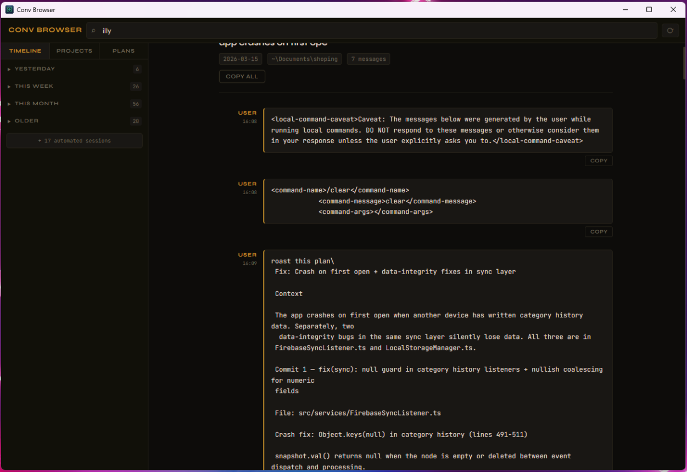

# Total Recall

Your complete Claude Code memory — every conversation, every plan, every exchange — browsable and free.



Memory tools like MemPalace try to decide what matters. They burn tokens on every message mining your history, and still miss half of what you actually need.

Total Recall stores everything and costs nothing to access. Browse your full history, search across all sessions, read plans inline — then bring exactly what's relevant into context yourself. No hooks, no background calls, no token overhead.

## Features

- Browse every conversation grouped by timeline or project
- Full-text search across all sessions and plans
- View plans (thinking blocks) inline alongside conversations
- Completely passive — no writes to your Claude data, ever

## Installation

Download the latest release from the [Releases page](https://github.com/sinful1992/conv-browser/releases):

| Platform | File |
|----------|------|
| Linux (Debian/Ubuntu) | `.deb` |
| Linux (universal) | `.AppImage` |
| Windows | `.msi` or `.exe` |

### Linux `.deb`

```sh
sudo dpkg -i total-recall_*.deb
```

### Linux `.AppImage`

```sh
chmod +x total-recall_*.AppImage
./total-recall_*.AppImage
```

## Building from source

Requires: [Rust](https://rustup.rs) stable, [Tauri v2 prerequisites](https://tauri.app/start/prerequisites/)

```sh
git clone https://github.com/sinful1992/conv-browser.git
cd conv-browser
cargo tauri build
```

For a quick dev run without bundling:

```sh
cargo run
```

## How it works

Total Recall scans `~/.claude/projects/` for Claude Code JSONL session files, indexes them into a local SQLite cache at `~/.cache/total-recall/index.sqlite`, and serves a local HTTP interface rendered in a Tauri webview. The index is rebuilt incrementally on each launch.

## Tech stack

- **Backend:** Rust + [axum](https://github.com/tokio-rs/axum)
- **Frontend:** HTML/CSS/JS + [HTMX](https://htmx.org)
- **Desktop shell:** [Tauri 2](https://tauri.app)
- **Storage:** SQLite (via rusqlite) with FTS5 full-text search

## License

MIT
